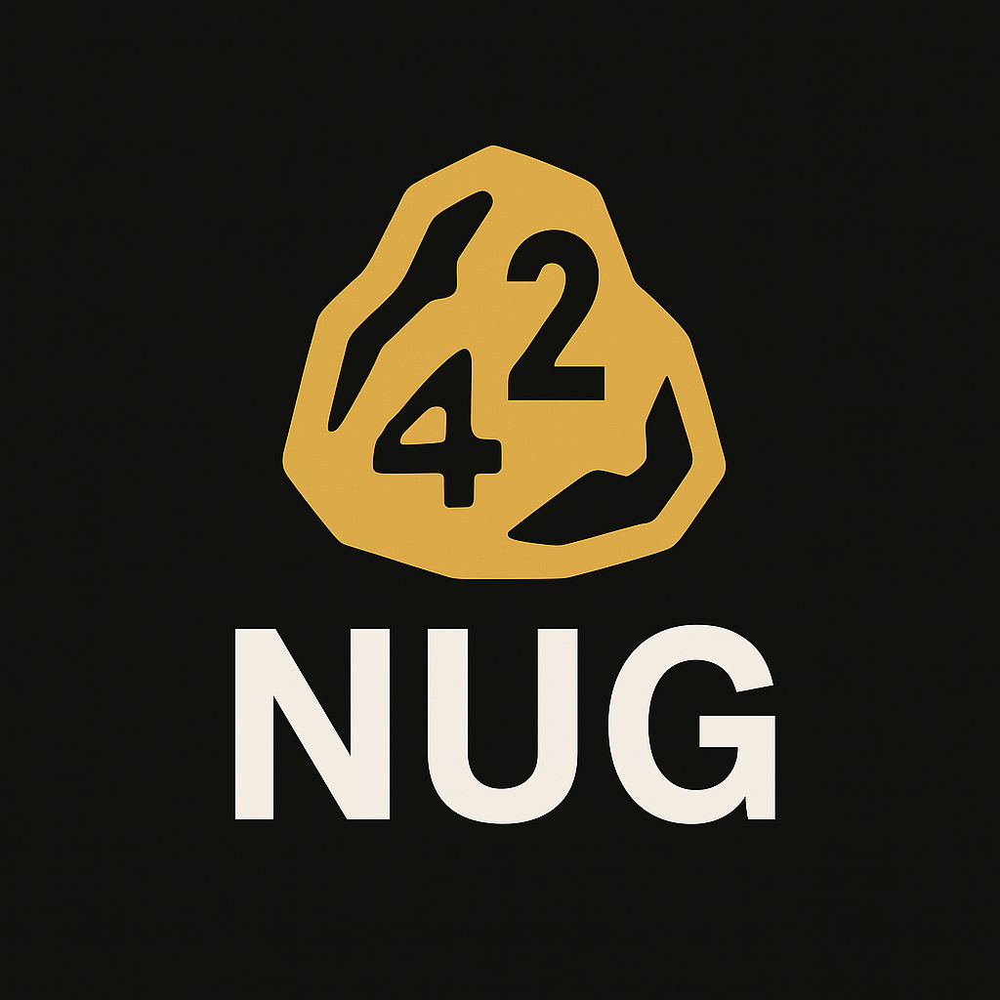

# 42nug (42n)



## Overview
###

- [Mandatory project in-depth explanation](.code.md)
- [Bonus project in-depth explanation](.code.md)

### Web3.0

Web 3.0 is a decentralized network that represents the next phase of the internet (Web 2.0). Unlike  its predecessors, Web 3.0 prioritizes user privacy and data ownership through blockchain and smart contracts, enabling direct interactions without middlemen. This approach aims to improve security, transparency, and trust in online activities, opening doors for new applications and services.

### Cryptocurrency and Cryptography

- Cryptocurrency is a type virtual currency that that relies on cryptography for security. Unlike traditional currencies, cryptocurrencies exist only in digital form and have no physical counterpart.  
- Cryptography is the process of securing communication and data from unauthorized access, using complex mathematical algorithms for the encryption, making it almost impossible to decipher.

### Token

The type of cryptocurrency that will be studied in this project is a Token.
Unlike coins (e.g. Bitcoin, Ethereum) that operate on their own independent blockchain, Tokens use an existing blockchain to perform their wide-range functionalities that are managed by a smart contract.
Coins are primarily used as a medium of exchange, data storage, or transaction payment. Whereas Tokens represent a variety of assets or utilities, such as digital assets, access to platform-specific services, or even voting rights within a decentralized application (dApp).

### Smart Contracts

Smart contracts are self-executing contracts with the terms of the agreement directly written into code. These contracts are hosted on a blockchain and are automatically executed when predefined conditions are met. Smart contracts play a pivotal role in decentralized applications (dApps) and advanced functionalities, requiring robust blockchains capable of handling complex computations and data.

### Blockchain

Blockchain is a type of distributed database designed to record, store, and transmit data securely across a decentralized network. It removes the need for a central authority by allowing participants (nodes) to manage and verify data collectively. The data is stored in “blocks” that are linked together in a chronological order, forming a continuous “chain,” which makes the entire system resistant to modification and tampering.

#### How does it work

- **Transaction Creation**: A transaction is initiated by a user (e.g., sending cryptocurrency, executing a smart contract, or storing data). This transaction is broadcast to the network.

- **Verification**: Nodes (computers on the network) verify the transaction using a consensus mechanism, ensuring that the data is valid and complies with the rules of the blockchain.

- **Block Creation**: Once verified, the transaction is bundled together with others into a "block." The block is then added to the chain in chronological order.

- **Consensus Mechanism**: The network reaches consensus on the validity of the block, depending on the type of blockchain, either through PoW, PoS, or other mechanisms. This process ensures that the blockchain remains consistent across all nodes.

- **Finalization**: Once consensus is reached, the new block is added to the chain, and the ledger is updated across all participants in the network.

## Project Implementation

### Solana Blockchain Platform

This project is implemented on the Solana blockchain, a high-performance platform chosen for its unique advantages:

- **High Throughput**: Capable of processing thousands of transactions per second
- **Low Fees**: Transaction costs typically under $0.01
- **Fast Finality**: Sub-second transaction confirmation
- **Energy Efficient**: Uses Proof of Stake consensus mechanism
- **Growing Ecosystem**: Rich development tools and community support

### SPL Token Standard

The 42nug token follows the SPL (Solana Program Library) Token standard, which provides:

- **Efficiency**: Minimal computational overhead for token operations
- **Flexibility**: Support for minting, burning, and custom permissions
- **Interoperability**: Seamless integration with Solana applications
- **Associated Token Accounts**: Simplified token management for users
- **Metadata Support**: Rich token information and display characteristics

### Programming Language: Rust

The smart contracts are written in Rust using the Anchor framework:

- **Memory Safety**: Prevents common security vulnerabilities
- **High Performance**: Zero-cost abstractions and efficient compilation
- **Concurrency**: Safe parallel processing capabilities
- **Strong Typing**: Compile-time error detection
- **Modern Features**: Pattern matching, type inference, and more

## Technical Architecture

### Core Components

1. **Token Mint**: The factory that creates new 42nug tokens
2. **Token Accounts**: Individual accounts that hold tokens for users
3. **Multisig Authority**: Multi-signature security for critical operations
4. **Transfer Mechanism**: Secure token transfer between accounts

### Smart Contract Functions

- `create_mint()`: Creates a new token mint with specified decimals
- `create_token_account()`: Opens a token account for a user
- `mint_tokens()`: Creates new tokens (requires mint authority)
- `transfer_tokens()`: Transfers tokens between accounts
- `create_multisig()`: Sets up multi-signature governance
- `multisig_mint_tokens()`: Mints tokens using multisig approval

### Security Features

- **Program Derived Addresses (PDAs)**: Deterministic, secure account generation
- **Authority Validation**: Strict permission checking for all operations
- **Multisig Support**: Require multiple signatures for critical functions
- **Account Verification**: Comprehensive validation of all account states

## Usage Guide

### Development Environment

The project uses **Solana Playground**, a web-based IDE that provides:
- Built-in Rust compiler for Solana
- Direct deployment to devnet/testnet
- Integrated testing environment
- Multiple wallet support for multisig testing

### Basic Operations

1. **Create Token Mint**: Initialize the 42nug token factory
2. **Setup Token Account**: Create an account to hold your tokens
3. **Mint Tokens**: Create new 42nug tokens (requires authority)
4. **Transfer Tokens**: Send tokens between accounts
5. **Multisig Operations**: Execute operations requiring multiple signatures

### Testing

The project includes comprehensive test suites for:
- Token creation and minting
- Account setup and management
- Transfer operations
- Multisig functionality
- Error handling and edge cases

## Project Structure

```
tokenizer/
├── code/                    # Main implementation
│   ├── programs/           # Rust smart contracts
│   ├── client/            # TypeScript client library
│   └── tests/             # Test suites
├── bonus/                  # Advanced multisig implementation
│   ├── programs/          # Enhanced smart contracts
│   ├── client/           # Advanced client features
│   └── tests/            # Extended test coverage
├── documentation/         # Project documentation
├── deployment/           # Deployment scripts and configs
└── docker-compose.yml    # Containerized development environment
```

## Features

### Core Token Features
- ✅ Token minting with configurable decimals
- ✅ Secure token transfers between accounts
- ✅ Account creation and management
- ✅ Authority-based permission system

### Advanced Features (Bonus)
- ✅ Multi-signature wallet implementation
- ✅ Threshold-based approval system (2-of-3 signatures)
- ✅ Multiple signer combinations
- ✅ Playground wallet integration

### Security Features
- ✅ Program Derived Address (PDA) security
- ✅ Authority validation on all operations
- ✅ Comprehensive error handling
- ✅ Account state verification

## Development Tools

### Solana Playground
- Web-based development environment
- No local installation required
- Built-in Rust compiler and deployer
- Multiple wallet support for testing

## Conclusion

The 42nug token project demonstrates a complete implementation of a Solana-based token with advanced features like multi-signature support. It serves as both a functional token system and an educational resource for understanding modern blockchain development practices, particularly within the Solana ecosystem.

The project showcases the power of Solana's high-performance blockchain, the security of Rust programming, and the flexibility of the SPL Token standard, making it an excellent foundation for understanding and building upon decentralized token systems.
